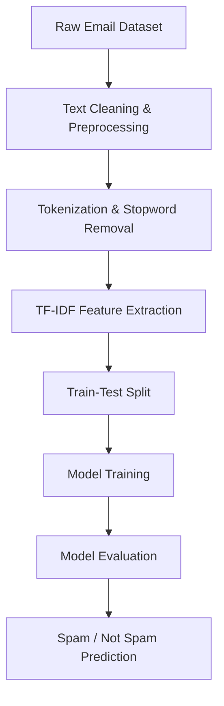

 
  
  
  
  
  
    

 
---

# 📧 Spam Email Classifier

A machine learning–based Spam Email Classifier that automatically detects whether an email is **Spam** or **Not Spam** using Natural Language Processing (NLP) techniques.  
The project focuses on text preprocessing, feature extraction, and classical ML models to build a lightweight and interpretable spam detection system.

---

## 🚀 Project Overview

Spam emails are a common problem in digital communication. This project aims to:
- Clean and preprocess raw email text
- Convert text into numerical features
- Train a machine learning model to classify emails
- Evaluate performance using standard metrics

The system is designed to be **simple, efficient, and easily extendable** to real-world email filtering applications.

---

## 🧠 Tech Stack

| Category              | Tools / Libraries |
|----------------------|------------------|
| Programming Language | Python           |
| Data Handling        | Pandas, NumPy    |
| NLP                  | NLTK / Regex     |
| Feature Extraction   | TF-IDF           |
| ML Models            | Naive Bayes / Logistic Regression |
| Evaluation           | Scikit-learn    |

---

## 🔁 Project Flow

---

## 🧹 Text Preprocessing Steps

| Step | Description |
|-----|------------|
| Lowercasing | Converts all text to lowercase |
| Removing Punctuation | Removes special characters and symbols |
| Stopword Removal | Eliminates common words like *the*, *is*, *and* |
| Tokenization | Splits text into individual words |

---

## 📊 Feature Engineering

- Used **TF-IDF Vectorization** to convert text data into numerical form  
- Helps capture important words while reducing the impact of frequent but irrelevant terms  

---

## 🤖 Model Training

| Model Used | Purpose |
|----------|--------|
| Naive Bayes / Logistic Regression | Efficient text classification |

The model was trained on labeled email data and evaluated using **accuracy** and **confusion matrix** to ensure reliable classification performance.

---

## 📈 Evaluation Metrics

| Metric | Description |
|------|------------|
| Accuracy | Overall correctness of predictions |
| Precision | Correct spam predictions |
| Recall | Ability to detect actual spam |
| Confusion Matrix | Visual performance analysis |

---

## 🔮 Future Enhancements

- Add deep learning models such as **LSTM** or **Transformer-based architectures**
- Implement **email header analysis** for improved detection
- Build a **web interface** using Flask or Streamlit
- Deploy the model as a **real-time spam detection API**

---

## 👩‍💻 Author

**Omanshi Kaushal**  
Computer Science & Engineering  
Interested in Machine Learning, NLP, and real-world AI applications

